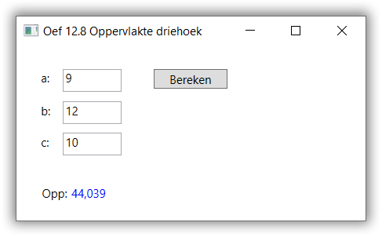
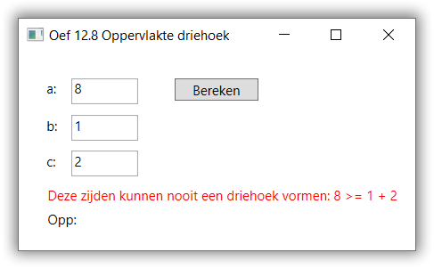

# Assignment

Your application looks like this:

The calculated area is rounded with 3 decimal digits and shown
in a `TextBlock` called `areaTextBlock`.

When you enter sides that don't form a triangle,
an appropriate error message is shown in a seperate `TextBlock`
called `errorTextBlock`.

You may assume the user always enters numbers into the textboxes.

Create a seperate function called `Max` to calculate the biggest
of 3 integers.
